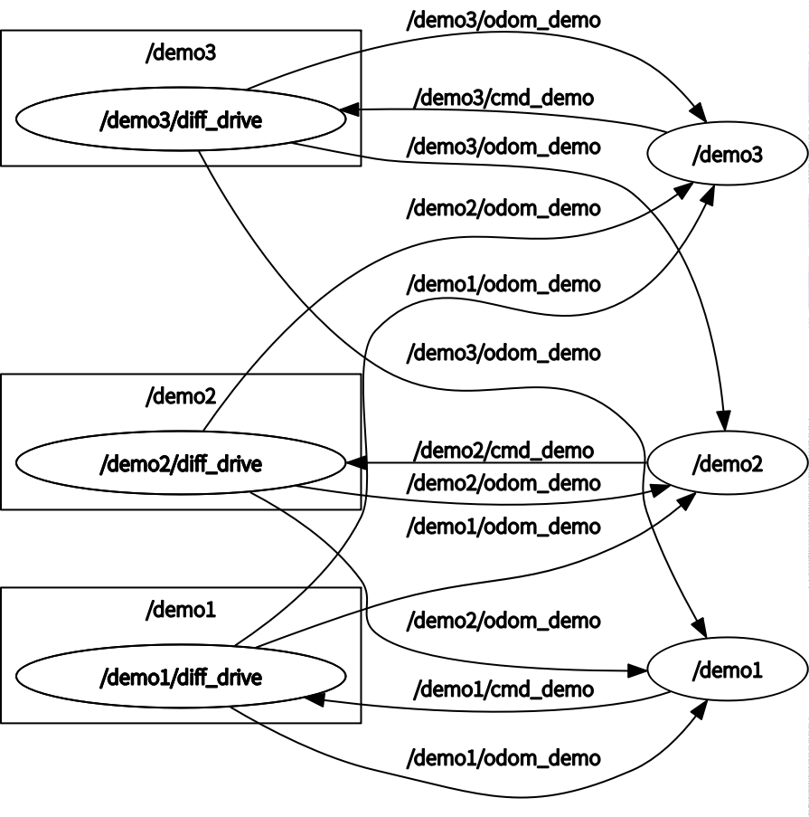

# Consistent-formation-control-algorithm
Consistent formation control algorithm in ROS2!

The node graph is like:

## Test video

In test_video, github do not support open video in markdown...

## How to use it

It's based ros2 and control toolbox. You need them first.

Install ROS2 and Control Toolbox.(You may find them in github...)

Install gazebo.

Copy "model/**my_model**" to the model path of gazebo.

Then build by command "**colcon build**".

**That's all building step.**

Next, run command "**gazebo world/three_aircraft_formation.world**"

Then run command "**ros2 run robot_key_control tac**"

You may see something great.

## Update log

03.01: Add ct in code. It's 23:36 and I think it's too late to work. Still I do some work... Update REDEME

03.02: Clean code and so on...

## TODO:

1. Add a subscription to change every robot's offset, choose the leader robot and so on.
2. Add limit...（It's import!)
3. Add a controller like PID or MPC.(Now it's position control...)
4. Fix bug...
5. ~~Make source away from hpp...~~(It's not import but easy...)
6. Get some Wend-Oil, **I wanna sleep!!!** ~~And I'm gonna sleep!!!~~
